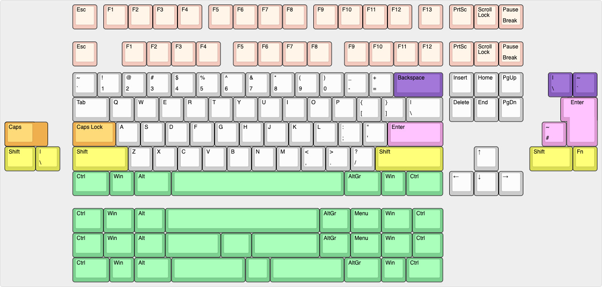
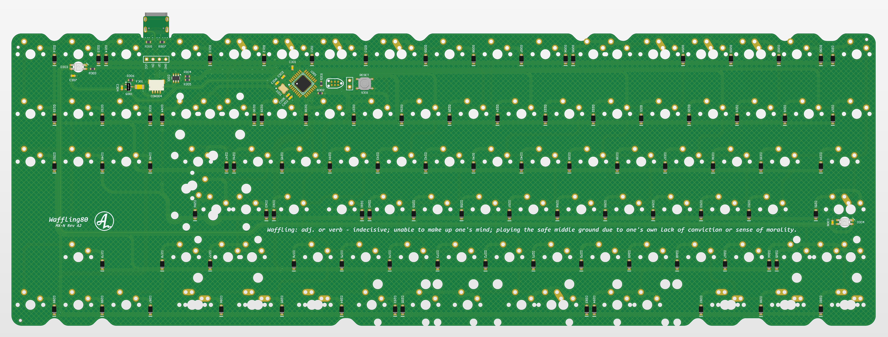
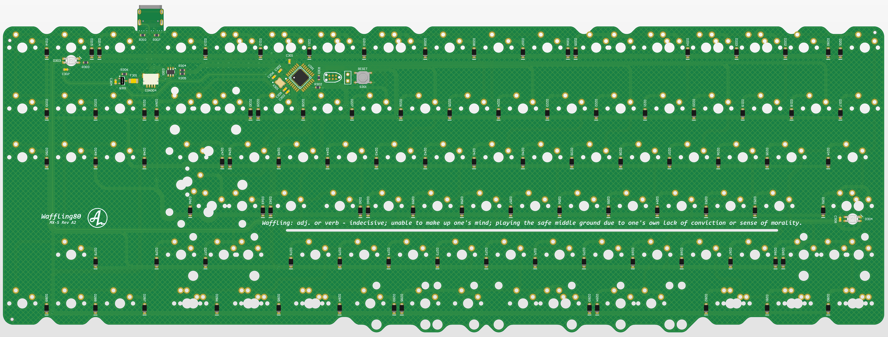
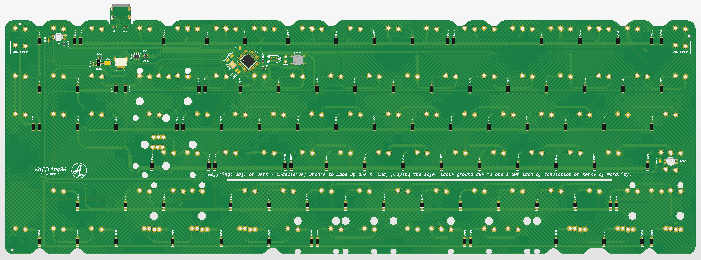
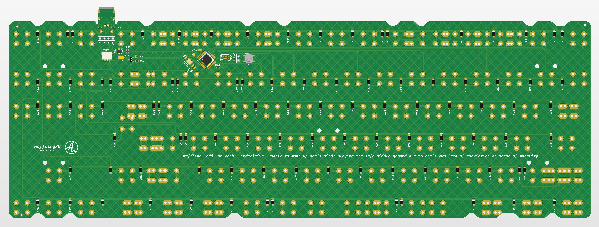
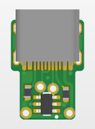

# Waffling80

Waffling80 is a multilayout TKL PCB with support for common ANSI and ISO layouts and split space. The goal is to provide a open source alternative that is compatible with many common TKL projects.

The project is split into four different PCB designs. Two MX-versions with different spacebar rotation, one ALPS-versions with north facing spacebar rotation (MX-style PCB mount stabs) and one HiTek-version. This may be changed.

***NOTE: This project is still mostly untested. The MX - North PCB design is tested and verified, but compatibility with different TKL projects is still to be tested. HiTek switch footprints are still untested.***

The distance between plate and PCB for a Hi-Tek board is 0.6mm bigger than a normal MX/Alps PCB. For this reason, I've added a small "USB Spacer PCB" to the NMB release that can be used if needed. If used, break away the normal USB-port and solder the USB Spacer PCB with no extra spacer.

## Features:
- QMK & VIA
- USB-C break away
- ATmega32U2 in QFN and QFP
- RGB-led under/close to caps lock and scroll lock for MX and Alps-versions (requires transparent housings)
- On ALPS-version: Dual action switch support on ESC and Pause/Break switch positions.
- Extensive layout support with F12 and F13, ISO and ANSI and more.

## Todo:
- Get VIA merged
- Verify functions of all PCB versions, this project is mostly untested.
- Test compatibility in cases.
- Evaluate the break away USB implementation

## Layout support: 

## MX - North: 

## MX - South:

## ALPS:

## NMB HiTek:

## NMB HiTek Spacer PCB:

## For ordering:
The files needed for manufacturing will be available in releases.

The following files are needed for the PCB Fab:
- BOM (contains component specifications)
- Pick and Place (contains component placement data)
- Gerber (contains PCB drawings and drill files)

For corrent horizontal USB position using the USB Spacer PCB, the spacer should be manufactured in a 0.6mm thickness.

## Releases
Files for manufacturing can be found in releases.

Releases are split into the following versions of the PCB: (note: not the same as configuration)
- Waffling80 MX - North, a MX solder PCB with north facing spacebar stabilizer support
- Waffling80 MX - South, a MX solder PCB with south facing spacebar stabilizer support
- Waffling80 ALPS, a ALPS solder PCB with north facing MX-style spacebar stabilizer support
- Waffling60 HiTek, a solder PCB for HiTek Space Invader switches

## For clarity
- Revision: When updating the PCB I bump the revision. The revision is specified with a letter and a number. For big changes, the letter is changed (usually also include code changes), for minor changes, only the number is bumped.
- Version: Version specifies different switch types, PCB's specific to certain cases etc.

## Revision history:
- Rev A1: Initial prototype
- Rev A2: Increased size of the PCB cutouts for o-ring and mounting posts. Moved components that was interfering with screw in stabilizers for backspace.

<a href='https://ko-fi.com/4pplet' target='_blank'>
